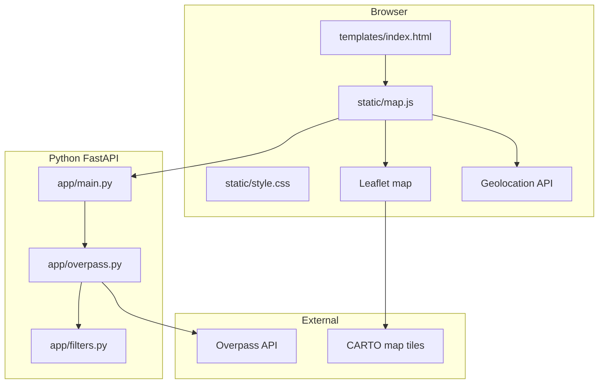

# Zaha Picks — Build Guide & Architecture (Python Edition)

A web app that helps you decide where to eat for lunch or dinner when you're indecisive. This README explains how the app works so you can **rebuild and extend it on your own**.

**Stack:** Python (FastAPI) backend + HTML/CSS frontend + a small amount of JavaScript for the interactive map.

**Repository:** [github.com/Anishs2k1/Zaha-Picks](https://github.com/Anishs2k1/Zaha-Picks)

---

## Table of contents

1. [What this app does](#what-this-app-does)
2. [Tools used and why](#tools-used-and-why)
3. [Why Python + a little JavaScript](#why-python--a-little-javascript)
4. [Project structure](#project-structure)
5. [Architecture overview](#architecture-overview)
6. [Step-by-step: build this from scratch](#step-by-step-build-this-from-scratch)
7. [Feature-by-feature implementation](#feature-by-feature-implementation)
8. [Data sources and APIs](#data-sources-and-apis)
9. [UI and design decisions](#ui-and-design-decisions)
10. [Commands reference](#commands-reference)
11. [Troubleshooting](#troubleshooting)
12. [How to extend the app](#how-to-extend-the-app)
13. [Learning path: what to study next](#learning-path-what-to-study-next)

---

## What this app does

**User problem:** You're hungry, you're nearby, you can't pick a restaurant.

**Solution:** Zaha Picks asks you to set required filters (meal, cuisine, radius), optionally filters for "open now," shows a map with a radius circle, then either:

- **Pick for me** — randomly selects one matching restaurant (server-side in Python)
- **Browse matches** — scroll the list and tap one yourself

| Requirement | How it's implemented |
|---|---|
| Map centered on screen | CSS grid + Leaflet in `static/map.js` |
| White background, soft map edges | CSS gradient overlays in `static/style.css` |
| Header "Zaha Picks" in Times New Roman | `.title` in CSS |
| Default 1-mile radius, expandable | `<select>` with values in meters |
| Forced choices: cuisine, lunch/dinner | Filter UI → Python API |
| Open now + within radius | `app/filters.py` |
| Radius animates on map | Leaflet circle + `requestAnimationFrame` |
| Two pick modes | `/api/pick` vs. list click |

---

## Tools used and why

### Backend (Python)

| Tool | Role | Why |
|---|---|---|
| **Python 3.10+** | Language | Readable, great for HTTP + data filtering |
| **FastAPI** | Web framework | Modern async API, automatic docs, easy static files |
| **Uvicorn** | ASGI server | Standard way to run FastAPI locally |
| **httpx** | HTTP client | Async requests to Overpass API |
| **Jinja2** | HTML templates | Serves the page from `templates/index.html` |

### Frontend (browser)

| Tool | Role | Why |
|---|---|---|
| **HTML + CSS** | Layout and design | Same look as the original app |
| **Leaflet (JS)** | Interactive map | Maps run in the browser; Leaflet is the standard |
| **`static/map.js`** | Map UI + API calls | Thin client — all restaurant logic lives in Python |

### External services (no API keys)

| Service | Used for |
|---|---|
| **OpenStreetMap / Overpass** | Restaurant data |
| **CARTO tiles** | Light map background |
| **Browser Geolocation** | User location |

---

## Why Python + a little JavaScript

This is a **Python-based app** because:

- Restaurant search, filtering, and random pick run in **Python** (`app/overpass.py`, `app/filters.py`, `app/main.py`)
- The server exposes **`/api/restaurants`** and **`/api/pick`**
- You can test logic with plain Python without a browser

**JavaScript is still used for:**

- **Leaflet** — interactive pan/zoom map (no practical Python-only alternative in the browser)
- **Geolocation** — browser permission API
- **Radius animation** — smooth circle updates on the map

That's typically ~200 lines in `static/map.js` vs. hundreds of lines of business logic in Python.

---

## Project structure

```
zaha-picks/
├── app/
│   ├── __init__.py
│   ├── main.py          # FastAPI routes + page render
│   ├── overpass.py      # Fetch & normalize OSM restaurants
│   ├── filters.py       # Cuisine, hours, distance helpers
│   └── constants.py     # Fallback location, cuisine aliases
├── templates/
│   └── index.html       # Page layout (Jinja2)
├── static/
│   ├── style.css        # All visual design
│   └── map.js           # Leaflet map + calls Python API
├── requirements.txt
├── README.md
└── .gitignore
```

---

## Architecture overview



### Request flow

1. Browser loads `/` → FastAPI renders `index.html`
2. `map.js` gets user location → calls `GET /api/restaurants?lat=&lng=&...`
3. Python queries Overpass, filters results, returns JSON
4. `map.js` draws markers and list
5. **Pick for me** → `GET /api/pick?...` → Python picks `random.choice()` server-side

---

## Step-by-step: build this from scratch

### Phase 1 — Python project setup

```bash
mkdir zaha-picks && cd zaha-picks
python3 -m venv .venv
source .venv/bin/activate   # Windows: .venv\Scripts\activate
pip install fastapi uvicorn httpx jinja2
```

Create `requirements.txt`:

```
fastapi>=0.115.0
uvicorn[standard]>=0.32.0
httpx>=0.27.0
jinja2>=3.1.0
```

### Phase 2 — FastAPI skeleton

`app/main.py`:

- `GET /` → render template
- `GET /api/restaurants` → search + filter
- `GET /api/pick` → random restaurant
- Mount `/static` for CSS/JS

Run:

```bash
uvicorn app.main:app --reload
```

Open `http://127.0.0.1:8000`

### Phase 3 — Port filter logic to Python

Move from the original JavaScript app into `app/filters.py`:

- `meal_window()` — lunch 11–15, dinner 17–22
- `is_open_for_meal()` — parse OSM `opening_hours`
- `matches_cuisine()` — alias map for cuisine dropdown
- `distance_meters()` — Haversine formula

### Phase 4 — Overpass client

`app/overpass.py` uses **httpx** to POST an Overpass QL query:

```overpass
[out:json][timeout:25];
(
  node["amenity"~"restaurant|fast_food|cafe"](around:RADIUS,LAT,LNG);
  way["amenity"~"restaurant|fast_food|cafe"](around:RADIUS,LAT,LNG);
);
out center tags;
```

Normalize each element into a dict with `id`, `name`, `lat`, `lng`, `distance`, `address`, etc.

### Phase 5 — Frontend (same design)

Copy the original CSS unchanged. `static/map.js` only:

- Initializes Leaflet
- Calls your Python API instead of Overpass directly
- Updates DOM from JSON responses

### Phase 6 — Template

`templates/index.html` is the same HTML as before, with:

```html
<link rel="stylesheet" href="/static/style.css" />
<script src="/static/map.js"></script>
```

---

## Feature-by-feature implementation

| Feature | File(s) | Key piece |
|---|---|---|
| Page render | `app/main.py` | `GET /` |
| Restaurant search API | `app/main.py`, `app/overpass.py` | `GET /api/restaurants` |
| Random pick API | `app/main.py` | `GET /api/pick` + `random.choice` |
| Cuisine filter | `app/filters.py` | `matches_cuisine()` |
| Open now filter | `app/filters.py` | `is_open_for_meal()` |
| Map + radius animation | `static/map.js` | Leaflet |
| Soft map fade | `static/style.css` | `.map-fade-*` |

---

## Data sources and APIs

### Your API (local)

**Search restaurants**

```
GET /api/restaurants?lat=40.42&lng=-86.90&radius_meters=1609&cuisine=any&meal=lunch&open_now=true
```

**Random pick**

```
GET /api/pick?lat=40.42&lng=-86.90&radius_meters=1609&cuisine=italian&meal=dinner&open_now=true
```

**Interactive API docs** (built into FastAPI): `http://127.0.0.1:8000/docs`

### Overpass API

- Endpoint: `https://overpass-api.de/api/interpreter`
- Method: POST with Overpass QL body
- Debug visually: [overpass-turbo.eu](https://overpass-turbo.eu)

---

## UI and design decisions

Same as the original Zaha Picks:

- White background, Times New Roman header
- Map centered with soft faded edges
- Side panels for filters and results
- Radius shown in miles in UI, meters in code/API

---

## Commands reference

```bash
# One-time setup
cd zaha-picks
python3 -m venv .venv
source .venv/bin/activate
pip install -r requirements.txt

# Run locally (with auto-reload)
uvicorn app.main:app --reload

# Run on a specific port
uvicorn app.main:app --reload --port 8080
```

Open **http://127.0.0.1:8000**

---

## Troubleshooting

| Problem | Fix |
|---|---|
| `ModuleNotFoundError: app` | Run uvicorn from project root; activate venv |
| Map is blank | Check Leaflet CSS CDN + `#map` height in CSS |
| No restaurants | Widen radius; check `/api/restaurants` in browser or `/docs` |
| Geolocation blocked | Allow location or use fallback (West Lafayette) |
| Overpass timeout | Wait and retry; reduce query frequency |

---

## How to extend the app

### Easy
- Add cuisines in `templates/index.html` + `CUISINE_ALIASES` in `constants.py`
- Save last filters in `localStorage` from `map.js`

### Medium
- Add `POST /api/favorites` with SQLite
- Deploy on [Render](https://render.com) or [Railway](https://railway.app) with `uvicorn app.main:app --host 0.0.0.0 --port $PORT`

### Hard
- Google Places for better hours/ratings
- User accounts with auth

---

## Learning path: what to study next

1. **Python basics** — functions, dicts, `async`/`await`
2. **FastAPI tutorial** — [fastapi.tiangolo.com](https://fastapi.tiangolo.com)
3. **httpx** — async HTTP requests
4. **Leaflet** — [leafletjs.com/examples](https://leafletjs.com/examples.html)
5. **Overpass QL** — [wiki.openstreetmap.org/wiki/Overpass_API](https://wiki.openstreetmap.org/wiki/Overpass_API)

---

## Quick recap

**Zaha Picks (Python)** is:

- A **FastAPI** server with restaurant logic in **Python**
- A **Jinja2** HTML template + **CSS** for the same UI
- A thin **Leaflet** JavaScript layer for the map
- **OpenStreetMap** data via **Overpass**

Run `uvicorn app.main:app --reload` and build from there.

---

## License

Personal project — use and modify freely.
