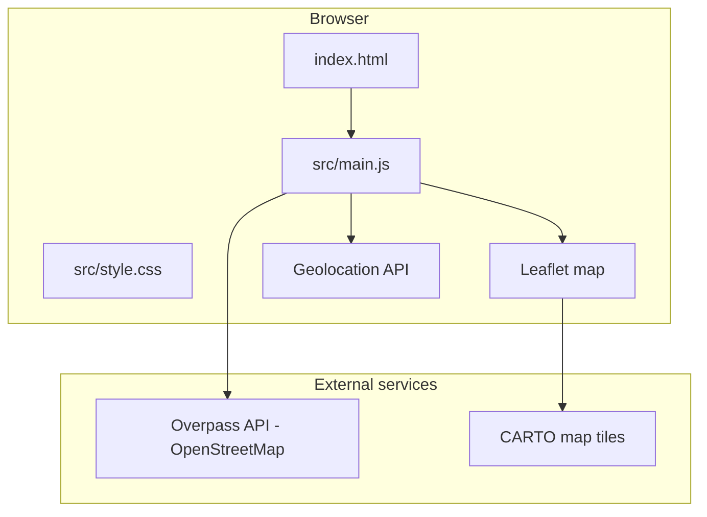

# Zaha Picks — Build Guide & Architecture

A web app that helps you decide where to eat for lunch or dinner when you're indecisive. This README is written so you can **rebuild and extend the app on your own** — every major decision, tool, file, and step is explained below.

---

## Table of contents

1. [What this app does](#what-this-app-does)
2. [Tools used and why](#tools-used-and-why)
3. [What we deliberately did NOT use](#what-we-deliberately-did-not-use)
4. [Project structure](#project-structure)
5. [Architecture overview](#architecture-overview)
6. [Step-by-step: build this from scratch](#step-by-step-build-this-from-scratch)
7. [Feature-by-feature implementation](#feature-by-feature-implementation)
8. [Data sources and APIs](#data-sources-and-apis)
9. [UI and design decisions](#ui-and-design-decisions)
10. [Commands reference](#commands-reference)
11. [Troubleshooting](#troubleshooting)
12. [How to extend the app](#how-to-extend-the-app)
13. [Learning path: what to study next](#learning-path-what-to-study-next)

---

## What this app does

**User problem:** You're hungry, you're nearby, you can't pick a restaurant.

**Solution:** Zaha Picks asks you to set required filters (meal, cuisine, radius), optionally filters for "open now," shows a map with a radius circle, then either:

- **Pick for me** — randomly selects one matching restaurant
- **Browse matches** — shows a scrollable list you tap to choose

**Core constraints from the original design:**

| Requirement | How it's implemented |
|---|---|
| Map centered on screen | CSS grid layout with map in the middle column |
| White background, soft map edges | CSS gradient overlays on top of the map |
| Header "Zaha Picks" in Times New Roman | `.title` in `src/style.css` |
| Default 1-mile radius, expandable | `<select>` with values in meters (1609 = 1 mi) |
| Forced choices: cuisine, lunch/dinner | Segmented buttons + dropdown before search runs |
| Open now + within radius | Filter logic in `src/main.js` |
| Radius animates on map | Leaflet circle + `requestAnimationFrame` |
| Two pick modes | Random button vs. browse list |

---

## Tools used and why

### Runtime stack

| Tool | Version | Role | Why this choice |
|---|---|---|---|
| **HTML** | — | Page structure | Every web app starts here. No framework needed for v1. |
| **CSS** | — | Layout, typography, map fade effect | Full control over the white/minimal aesthetic without fighting a UI library. |
| **JavaScript (ES modules)** | ES2020+ | All app logic | Native `import`/`export`. No build step required for language features beyond what Vite handles. |
| **Vite** | 5.x | Dev server + bundler | Fast local dev, hot reload, simple config. Much lighter than Create React App or Next.js for a single-page map app. |
| **Leaflet** | 1.9.x | Interactive map | Free, open source, no API key for basic maps. Industry standard for embeddable maps. |
| **Node.js** | 18+ recommended | Runs Vite | Required for `npm` and the dev server. |

### External services (no API keys required for core features)

| Service | Used for | Cost | Why |
|---|---|---|---|
| **OpenStreetMap** (via Overpass API) | Restaurant locations, names, cuisine tags, opening hours | Free | No signup, no billing, good enough for a personal decision app. |
| **CARTO basemap tiles** | Light gray map tiles | Free tier | Clean look that matches the white UI better than default OSM tiles. |
| **Browser Geolocation API** | "Where am I?" | Free, built into browsers | Standard way to center the map on the user. |

### Development tools

| Tool | Purpose |
|---|---|
| **npm** | Install dependencies, run scripts |
| **VS Code / Cursor** | Edit code |
| **Browser DevTools** | Debug network requests, geolocation, console errors |
| **curl** | Test API routes from the terminal |

---

## What we deliberately did NOT use

Understanding *why* something was skipped is as important as knowing what was picked.

| Alternative | Why we skipped it (for v1) |
|---|---|
| **React / Vue / Angular** | Adds complexity (components, state libraries, routing) before the core idea is proven. Plain JS is easier to learn from. |
| **Google Maps / Mapbox** | Require API keys, billing accounts, and usage limits. Leaflet + free tiles avoids that. |
| **Google Places / Yelp API** | Richer data (hours, ratings) but need API keys and often cost money. |
| **Backend database** | No user accounts, no saved history yet — everything is fetched live. |
| **TypeScript** | Helpful at scale, but adds a learning layer. JavaScript keeps the first version simpler. |
| **Tailwind / Bootstrap** | Custom CSS was enough for this layout and teaches fundamentals. |

You can add any of these later once the vanilla version makes sense.

---

## Project structure

```
zaha-picks/
├── index.html              # Page skeleton: header, panels, map container, script tag
├── package.json            # Dependencies (leaflet, vite) and npm scripts
├── README.md               # This file
│
├── src/
│   ├── main.js             # App brain: map, filters, search, pick logic
│   └── style.css           # All visual design (layout, map fade, typography)
│
└── dist/                   # Production build output (`npm run build`) — auto-generated
```

### File responsibilities in one sentence each

- **`index.html`** — Defines the DOM: where the map, filters, list, and result card live.
- **`src/main.js`** — Owns all state, wires up event listeners, talks to Overpass.
- **`src/style.css`** — Makes it look like the design (white bg, faded map, Times New Roman header).

---

## Architecture overview



### Data flow when user opens the app

1. Browser loads `index.html` → Vite serves `src/main.js` and `src/style.css`.
2. `main.js` initializes Leaflet map with CARTO tiles.
3. Browser asks for geolocation → map centers on user (fallback: West Lafayette, IN).
4. A circle is drawn at the user's location with radius = selected miles.
5. Overpass API is queried for `restaurant`, `fast_food`, and `cafe` within that radius.
6. Results are filtered by cuisine, meal window ("open now"), and radius.
7. Markers appear on map; list populates in the right panel.
8. User clicks **Pick for me** or selects from the list.

---

## Step-by-step: build this from scratch

Follow these steps in order if you want to recreate the app yourself.

### Phase 1 — Project setup (15 minutes)

**Step 1: Create the folder and initialize npm**

```bash
mkdir zaha-picks
cd zaha-picks
npm init -y
```

**Step 2: Install dependencies**

```bash
npm install leaflet
npm install -D vite
```

- `leaflet` = map library (production dependency — shipped to the browser)
- `vite` = dev tool only (not shipped to users)

**Step 3: Enable ES modules in `package.json`**

Add at the top level:

```json
"type": "module"
```

This lets you write `import L from "leaflet"` instead of `require()`.

**Step 4: Add npm scripts**

```json
"scripts": {
  "dev": "vite",
  "build": "vite build",
  "preview": "vite preview"
}
```

**Step 5: Create folder structure**

```bash
mkdir src server
touch index.html src/main.js src/style.css
```

**Step 6: Start the dev server**

```bash
npm run dev
```

Open the URL Vite prints (usually `http://localhost:5173`).

---

### Phase 2 — HTML skeleton (30 minutes)

**Goal:** Three-column layout — filters left, map center, results right.

Key decisions in `index.html`:

1. **Semantic sections** — `<header>`, `<main>`, `<aside>` for accessibility and clarity.
2. **IDs on interactive elements** — e.g. `id="cuisine-select"` so JavaScript can attach listeners.
3. **Leaflet CSS from CDN** — Loaded in `<head>` before your own CSS.
4. **Module script** — `<script type="module" src="/src/main.js">` at the bottom of `<body>`.

Elements you need at minimum:

- Meal toggle (Lunch / Dinner buttons)
- Cuisine `<select>`
- Radius `<select>` (values in **meters**: 1609, 3218, 4828, 8047)
- Checkboxes: Open now
- Map div: `id="map"` inside a wrapper for fade overlays
- Restaurant list: `<ul id="restaurant-list">`
- Result card (hidden until a pick is made)

---

### Phase 3 — CSS and visual design (45 minutes)

**Goal:** White background, large Times New Roman title, map with soft edges.

#### Layout: CSS Grid

```css
.main {
  display: grid;
  grid-template-columns: minmax(240px, 280px) 1fr minmax(260px, 320px);
}
```

Three columns: left panel | map | right panel. On small screens, stack vertically with `@media (max-width: 1100px)`.

#### Map fade effect

The map doesn't have hard edges. Four absolutely positioned divs sit on top of the map:

```css
.map-fade-top {
  background: linear-gradient(to bottom, var(--bg), transparent);
}
```

Same idea for bottom, left, right. `pointer-events: none` so clicks pass through to the map.

#### Typography

```css
.title {
  font-family: "Times New Roman", Times, serif;
  font-size: clamp(3rem, 8vw, 5.5rem);
}
```

`clamp()` makes the header scale on mobile without separate breakpoints.

#### CSS variables

Colors and spacing live in `:root` so you can tweak the whole theme in one place.

---

### Phase 4 — Map with Leaflet (1 hour)

**Goal:** Centered map, user marker, radius circle.

#### Initialize the map (`src/main.js`)

```javascript
import L from "leaflet";
import "leaflet/dist/leaflet.css";

const map = L.map("map").setView([40.4259, -86.9081], 14);

L.tileLayer("https://{s}.basemaps.cartocdn.com/light_all/{z}/{x}/{y}{r}.png", {
  attribution: '...',
  subdomains: "abcd",
  maxZoom: 19,
}).addTo(map);
```

**Why CARTO light tiles?** Default OSM tiles are colorful and compete with the minimal white UI. CARTO `light_all` is neutral gray.

#### Radius circle

```javascript
const radiusCircle = L.circle([lat, lng], {
  radius: 1609,  // meters — 1 mile
  color: "rgba(45, 45, 45, 0.35)",
  fillColor: "rgba(45, 45, 45, 0.06)",
}).addTo(map);
```

Leaflet circles use **meters**, not miles. Conversion: `1 mile ≈ 1609.34 meters`.

#### Animated radius changes

When the user changes radius, don't jump instantly — animate with `requestAnimationFrame` and ease the radius value over ~450ms, then `map.fitBounds(circle.getBounds())`.

#### User location

```javascript
navigator.geolocation.getCurrentPosition(
  (pos) => { /* use pos.coords.latitude, pos.coords.longitude */ },
  () => { /* fallback coordinates */ }
);
```

Browsers require HTTPS or localhost for geolocation. Always provide a fallback city.

---

### Phase 5 — Restaurant data from OpenStreetMap (1–2 hours)

**Goal:** Fetch real restaurants near the user.

#### What is Overpass?

[Overpass API](https://wiki.openstreetmap.org/wiki/Overpass_API) is a read-only query engine over OpenStreetMap data. You send a **Overpass QL** query; it returns JSON.

#### Example query

```overpass
[out:json][timeout:25];
(
  node["amenity"~"restaurant|fast_food|cafe"](around:1609,40.4259,-86.9081);
  way["amenity"~"restaurant|fast_food|cafe"](around:1609,40.4259,-86.9081);
);
out center tags;
```

Breaking it down:

| Part | Meaning |
|---|---|
| `[out:json]` | Response format |
| `node[...]` | Point features (single lat/lng) |
| `way[...]` | Area features (buildings, polygons) — need `out center` to get a center point |
| `amenity~"restaurant\|fast_food\|cafe"` | Tag filter: amenity type matches regex |
| `(around:1609,lat,lng)` | Within 1609 meters of point |
| `out center tags` | Return center coordinates + all OSM tags |

#### Fetch from JavaScript

```javascript
const response = await fetch("https://overpass-api.de/api/interpreter", {
  method: "POST",
  body: queryString,
});
const data = await response.json();
```

#### Normalize OSM elements into your app shape

Each restaurant object should have at minimum:

```javascript
{
  id: "node/12345",
  name: "Example Cafe",
  lat: 40.42,
  lng: -86.91,
  cuisine: "italian",
  openingHours: "Mo-Su 11:00-22:00",
  distance: 842,  // meters from user
  tags: { /* raw OSM tags */ }
}
```

Skip elements without a `name` tag — many OSM nodes are incomplete.

#### Distance calculation (Haversine formula)

Compare each restaurant to the user's lat/lng to sort by nearest first. Implemented in `distanceMeters()` in `main.js`.

---

### Phase 6 — Filters (1 hour)

**Goal:** Only show restaurants matching user choices.

#### Cuisine filter

OSM uses a `cuisine=*` tag (e.g. `cuisine=italian;pizza`). Match against a dropdown value with alias lists:

```javascript
const aliases = {
  italian: ["italian", "pasta"],
  mexican: ["mexican", "tex-mex", "taco"],
  // ...
};
```

Also check if the cuisine term appears in the restaurant **name** as a fallback.

#### Lunch vs. dinner

This affects the **open hours window**, not the API query:

| Meal | Time window used for "open now" |
|---|---|
| Lunch | 11:00 – 15:00 |
| Dinner | 17:00 – 22:00 |

#### "Open right now" filter

OSM stores hours in `opening_hours=*` using a compact format like `Mo-Fr 11:00-22:00; Sa-Su 10:00-23:00`.

The app parses this manually in `isOpenForMeal()`. Limitations:

- Complex rules (holidays, "closed 2nd Tuesday") are not handled
- If no hours tag exists, the restaurant is **included** (benefit of the doubt)

For production-quality hours, you'd use Google Places or a dedicated opening-hours library.

#### Radius filter

Already handled by the Overpass `around:` clause, but also double-check with Haversine in case of edge cases.

---

### Phase 7 — Pick modes (30 minutes)

**Pick for me:**

```javascript
const index = Math.floor(Math.random() * state.restaurants.length);
selectRestaurant(state.restaurants[index]);
```

**Browse matches:**

Re-render the list and scroll it into view. Each list item gets a click handler that calls `selectRestaurant(place)`.

**selectRestaurant** updates:

- Result card (name, meta, address)
- Google Maps directions link
- Map pan + highlight marker

---

## Feature-by-feature implementation

| Feature | File(s) | Key function / element |
|---|---|---|
| Map display | `main.js` | `initMap()` |
| Soft map edges | `style.css` | `.map-fade-*` overlays |
| Geolocation | `main.js` | `locateUser()` |
| Radius circle | `main.js` | `radiusCircle`, `animateRadius()` |
| OSM restaurant search | `main.js` | `fetchRestaurants()` |
| Cuisine filter | `main.js` | `matchesCuisine()` |
| Open now filter | `main.js` | `isOpenForMeal()`, `mealWindow()` |
| Random pick | `main.js` | `pickRandomRestaurant()` |
| Browse list | `main.js` | `renderRestaurantList()` |

---

## Data sources and APIs

### Overpass API

- **Endpoint:** `https://overpass-api.de/api/interpreter`
- **Method:** POST with Overpass QL in body
- **Rate limits:** Be polite — don't hammer it. For a personal app, one query per filter change is fine.
- **Public instances:** [overpass-api.de](https://overpass-api.de), [overpass.kumi.systems](https://overpass.kumi.systems)
- **Debug queries visually:** [overpass-turbo.eu](https://overpass-turbo.eu)

### Useful OSM tags for restaurants

| Tag | Example | Used for |
|---|---|---|
| `amenity=restaurant` | — | Identifying restaurants |
| `name=*` | `name=Chipotle` | Display name |
| `cuisine=*` | `cuisine=mexican` | Cuisine filter |
| `opening_hours=*` | `Mo-Su 11:00-22:00` | Open now filter |
| `addr:street`, `addr:city` | — | Address display |

### CARTO map tiles

- **URL pattern:** `https://{s}.basemaps.cartocdn.com/light_all/{z}/{x}/{y}{r}.png`
- **Attribution required** — included in the Leaflet `attribution` option
- **Alternative free tiles:** OpenStreetMap default, Stadia Maps (requires free API key)

### Browser Geolocation API

- **Docs:** [MDN Geolocation](https://developer.mozilla.org/en-US/docs/Web/API/Geolocation_API)
- **Requires:** User permission + HTTPS or localhost
- **Fallback:** Hardcoded coordinates when denied (currently West Lafayette, IN)

---

## UI and design decisions

| Decision | Rationale |
|---|---|
| White background | User request; feels clean and editorial with Times New Roman header |
| Map in center column | Visual focus; filters and results are secondary panels |
| Soft map fade | Avoids harsh rectangular map box; blends into white page |
| Times New Roman header | User request; contrasts with sans-serif body text |
| Segmented Lunch/Dinner buttons | Faster than dropdown for binary choice |
| Radius in miles in UI, meters in code | Users think in miles; Leaflet/Overpass think in meters |
| Cards with light shadow | Separates panels from white background without heavy borders |
| Mobile: single column stack | Map first, then filters, then list — map stays primary |

---

## Commands reference

```bash
# Install dependencies (first time or after clone)
npm install

# Start dev server with hot reload
npm run dev

# Build static files for production
npm run build

# Preview production build locally
npm run preview
```

---

## Troubleshooting

| Problem | Likely cause | Fix |
|---|---|---|
| Map is blank gray box | Leaflet CSS not loaded | Check `<link>` to leaflet.css in `index.html` and `import "leaflet/dist/leaflet.css"` in main.js |
| No restaurants found | Overpass timeout or empty area | Widen radius; check DevTools Network tab for Overpass errors |
| "Getting your location…" forever | Geolocation denied | Allow location in browser or rely on fallback city |
| Overpass 429 / timeout | Too many requests | Wait 30s; reduce refresh frequency |
| `npm run dev` fails on Node | Node version too old | Use Node 18+ (Vite 5 requirement) |

---

## How to extend the app

Ideas ordered from easiest to hardest:

### Easy

- [ ] Add more cuisine options to the dropdown
- [ ] Add radius options (0.5 mi, 10 mi)
- [ ] Remember last filters in `localStorage`
- [ ] Show restaurant count in the header status line

### Medium

- [ ] **Exclude list** — "don't show me these again" stored in localStorage
- [ ] **Favorites** — star restaurants, bias random pick toward favorites
- [ ] **Price filter** — if using a richer API
- [ ] Deploy to [Netlify](https://netlify.com) or [Vercel](https://vercel.com) for static hosting

### Hard

- [ ] **Google Places integration** — better hours, ratings, photos (needs API key + billing)
- [ ] **User accounts** — requires backend + database (Supabase, Firebase)
- [ ] **Native mobile app** — React Native or Capacitor wrapper around the web app

### Adding a new filter (pattern to follow)

1. Add UI control in `index.html`
2. Add state property in `state` object in `main.js`
3. Add event listener in `bindControls()`
4. Add filter logic in `applyStandardFilters()` or `fetchRestaurants()`
5. Call `refreshRestaurants()` when the control changes

---

## Learning path: what to study next

To build apps like this independently, study these topics in order:

### 1. Web fundamentals (1–2 weeks)

- HTML structure and semantic tags
- CSS layout: **Flexbox** and **Grid**
- JavaScript: variables, functions, arrays, `async`/`await`, `fetch`
- **Resource:** [MDN Web Docs](https://developer.mozilla.org)

### 2. Browser APIs (3–5 days)

- Geolocation API
- DOM manipulation (`querySelector`, `addEventListener`)
- ES modules (`import` / `export`)
- **Resource:** MDN guides for each API

### 3. Maps (2–3 days)

- [Leaflet quick start guide](https://leafletjs.com/examples/quick-start/)
- Understand tile layers, markers, circles, popups
- Practice: put a marker on a map at your home coordinates

### 4. OpenStreetMap & Overpass (2–3 days)

- [Overpass Turbo](https://overpass-turbo.eu) — run queries visually
- [Overpass QL wiki](https://wiki.openstreetmap.org/wiki/Overpass_API/Overpass_QL)
- Practice: query all cafes in your city

### 5. Build tooling (1–2 days)

- What `npm` and `package.json` do
- [Vite guide](https://vite.dev/guide/)
- Difference between dev server and production build

### 6. Backend basics (when you need them)

- Why browsers can't call some APIs directly (CORS)
- Simple Node.js HTTP server or serverless functions
- Environment variables (`.env`)

### 7. Next app frameworks (when ready)

- **React** — if the app grows beyond one page
- **Next.js** — if you need server routes + deployment in one project
- **Supabase** — if you need auth and a database

---

## Quick recap

**Zaha Picks is:**

- A **vanilla HTML/CSS/JS** single-page app
- Bundled and served in dev by **Vite**
- With a **Leaflet** map and **CARTO** tiles
- Pulling restaurant data from **OpenStreetMap via Overpass**
- With all layout and styling in **custom CSS** — no component library

You don't need AI to rebuild it. You need: a text editor, Node.js, a browser, and comfort reading API docs. Start with Phase 1 above, get the map showing, then add one feature at a time.

---

## License

Personal project — use and modify freely.
